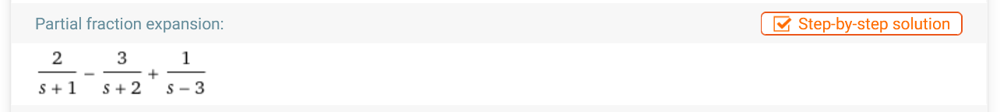
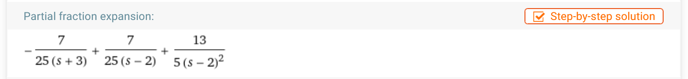
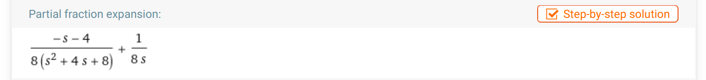
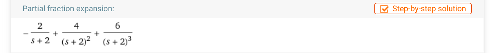
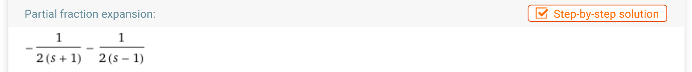

<script type="text/x-mathjax-config">
  MathJax.Hub.Config({
    tex2jax: {
      inlineMath: [ ['$','$'], ["\\(","\\)"] ],
      processEscapes: true
    },
    CommonHTML: { scale: 110, linebreaks: { automatic: true } }
  });
</script>

<script type="text/javascript" async
  src="https://cdnjs.cloudflare.com/ajax/libs/mathjax/2.7.5/MathJax.js?config=TeX-MML-AM_CHTML">
</script>
<script type="text/javascript" src="tutorialSheetScripts.js"> </script>
<link rel="stylesheet" type="text/css" media="all" href="styles.css">

# Laplace Transforms Tutorial Sheet, Sheet #9

### Learning targets
* Derive the laplace transforms of given definitions
* Use the formula sheet to carry out transforms and inverse transforms 
* Identify, rearrange and manipulate expressions to be in a 'transformable' format
* Use Laplace to solve non homogenous ODE's

<br><br>

# Additional Resources

## Tutorials
* [MIT Lecture](https://www.youtube.com/watch?v=sZ2qulI6GEk) : Very clear lecture by Arthur Mattuck , including the origin of laplace.

## Software 

* [Visualisations and Code](https://johnflux.com/2019/02/12/laplace-transform-visualized/) : Nice visualisations along with github to code to have a play with.

<br><br>

# Problem sheet
## Essential Questions
### Problem 1.
Using the given definition, derive the following laplace transforms: 

$
\mathcal{L} \{ f(t) \} =\int_{0}^{\infty}f(t){e^{-st}}{dt}=F(s),\quad{s>0}
$

(a) $f(t)=e^{at}$
<div class = "answer">
$\Rightarrow{}\quad$
$F(s)=\int_{0}^{\infty}{e^{-st}{e^{at}}}{dt}=\int_{0}^{\infty}{e^{-(s-a)t}{dt}}=\left[-\frac{1}{s-a}e^{-(s-a)t}\right]_0^\infty, \quad{s>a}$ <br>
$\Rightarrow{}\quad\boxed{F(s)=\frac{1}{s-a}}$
</div>
<div class = "workingout"><br><br><br><br><br><br><br><br></div>

(b) $g(t)=9$
<div class = "answer">
$\Rightarrow{}\quad$ 
$G(s)=\int_{0}^{\infty} \ {9e^{-st}{dt}}={[-\frac{9}{s}{e^{-st}}]_0^\infty}\quad$<br>
$\Rightarrow{}\quad\boxed{G(s)=\frac{9}{s}}$
</div>
<div class = "workingout"><br><br><br><br><br><br><br><br></div>

(c) $k(t)=4t$
<div class = "answer">
$\Rightarrow{}\quad$
$K(s)=\int_{0}^{\infty} 4t \ e^{-st} dt=4\int_{0}^{\infty} t \ e^{-st} dt$ <br>

Using integration by parts:
$udv=uv-\int{vdu}$ <br>

$u=t, dv=e^{-st}dt$ and $du=dt,$ <br> 
$v=-\frac{1}{s} e^{-st}$ <br>

$\Rightarrow{}\quad$
$4\int_{0}^{\infty} t \ e^{-st}dt=4(-\frac{t}{s} e^{-st} - \int_{0}^{\infty} \frac{-1}{s} e^{-st}dt)=4(\frac{1}{s^2}(-se^{-st}t-e^{-st}))_{0}^{\infty}$ <br>

$\Rightarrow{}\quad$
$\boxed{K(s)=\frac{4}{s^2}}$
</div>
<div class = "workingout"><br><br><br><br><br><br><br><br></div>

(d) $m(t)=e^{2t}$
<div class = "answer">
$\Rightarrow{}\quad$
$G(s)=\int_{0}^{\infty} \ {e^{-st}}{e^{2t}}{dt}={\left[-\frac{1}{s-2}{e^{-(s-2)t}}\right]_0^\infty}\quad$ <br>
$\Rightarrow{}\quad\ \boxed{G(s)=\frac{1}{s-2}}$
</div>
<div class = "workingout"><br><br><br><br><br><br><br><br></div>

(e) $a(t)=\sin(5t)$

<div class = "answer">
According to De Moivre's theorem, $\cos(at) + i\sin(at) = e^{iat}$ <br>
Using part (d) methodology $\Rightarrow{}\quad \mathcal{L}${$e^{5it}$} = $\frac{1}{s-5i}$ <br>
Rationalize the denominator $\Rightarrow{}\quad \mathcal{L}${$e^{5it}$} = $\frac{s}{s^2-5^2} + \frac{5i}{s^2-5^2}$ <br>
$\sin{}$ is the imaginary part. By using linearity $\Rightarrow{}\quad \boxed{A(s)=\frac{5}{s^2-5^2}}$ <br>

Note: The same process can be used to find the laplace of $\cos{}$ - take the real part, $\frac{s}{s^2-5^2}$!
</div>

<div class = "workingout"><br><br><br><br><br><br><br><br></div>

-----------------------------------

### Problem 2.
Using the DE1-MEM Formula sheet, find the Laplace Transforms of the given functions:

(a) $f(t)=6e^{-5t}+e^{3t}-5t^{3}-9$
<div class = "answer">
$\Rightarrow{}\quad$
$F(s)=\mathcal{L}\{ {6e^{-5t}+e^{3t}-5t^{3}-9}\}$ <br>

$\Rightarrow{}\quad$
$\boxed{F(s)=\frac{6}{s+5}+\frac{1}{s-3}-\frac{30}{s^4}-\frac{9}{s}}$
</div>
<div class = "workingout"><br><br><br><br><br><br><br><br></div>

(b) $g(t)=4\cos(4t)-9\sin(4t)+2\cos(10t)$
<div class = "answer">
$\Rightarrow{}\quad$
$G(s)=\mathcal{L}\{ {4\cos(4t)}\}-\mathcal{L}\{ {9\sin(4t)}\}+\mathcal{L}\{ {2\cos(10t)}\}$  <br>

$\Rightarrow{}\quad$
$\boxed{G(s)=\frac{4s}{ {s^2}+{16}}-\frac{36}{ {s^2}+{16}}+\frac{2s}{ {s^2}+{100}}}$
</div>
<div class = "workingout"><br><br><br><br><br><br><br><br></div>

(c) $k(t)=3\sinh(2t)+4\cosh(3t)$
<div class = "answer">
$\Rightarrow{}\quad$
$K(s)=\mathcal{L}\{ {3\sinh(2t)}\}+\mathcal{L}\{ {4\cosh(3t)}\}$ <br>

$\Rightarrow{}\quad$
$\boxed{K(s)=\frac{6}{ {s^2}-{4}}+\frac{4s}{ {s^2}-{9}}}$
</div>
<div class = "workingout"><br><br><br><br><br><br><br><br></div>

(d) $m(t)=e^{3t}+\cos(6t)-e^{3t}\cos(6t)$
<div class = "answer">
$\Rightarrow{}\quad$
$M(s)=\mathcal{L}\{ {e^{3t}}\}+\mathcal{L}\{ {\cos(6t)}\}-\mathcal{L}\{ {e^{3t}\cos(6t)}\}$ <br>
    
$\Rightarrow{}\quad$
$\boxed{M(s)=\frac{1}{ {s}-{3}}+\frac{s}{ {s^2}+{36}}-\frac{s-3}{ {(s-3)^2}+{36}}}$
</div>
<div class = "workingout"><br><br><br><br><br><br><br><br></div>

(e) $o(t)=e^{-2t}{\cos^2}(3t)-3t^2e^{3t}$
<div class = "answer">
$\Rightarrow{}\quad$
${\cos^2}(3t)$ can be writen as = $\frac{1+{\cos}(6t)}{2}$  <br>
$\Rightarrow{}\quad$
$O(s)=\mathcal{L}\{ {e^{-2t}}{(\frac{1}{2}+\frac{1}{2}{\cos}(6t))}-{3t^2e^{3t}}\}=\mathcal{L}\{\frac{1}{2}{e^{-2t}}+{\frac{1}{2}{e^{-2t}}{\cos}(6t)}-{3t^2e^{3t}}\}$ <br>
$\Rightarrow{}\quad$
$\boxed{O(s)=\frac{1}{ {2s}+{4}}+\frac{s+2}{2(s+2)^{2}+72}-\frac{6}{ {(s-3)^3}}}$
</div>
<div class = "workingout"><br><br><br><br><br><br><br><br></div>

-----------------------------------

### Problem 3.
Compute the inverse Laplace Transform of the given functions:

(a) $F(s)= \frac{5}{s}-\frac{4}{s-2}+\frac{24}{(s-2)^5}$
<div class = "answer">
$\mathcal{L}^{-1}\{F(s)\}= \ \mathcal{L}^{-1}\{ {\frac{5}{s}-\frac{4}{s-2}+\frac{24}{(s-2)^5}}\}$ <br>
    
$\Rightarrow{}\quad$
$\boxed{f(t)=5-{4e^{2t}}+e^{2t}{t^4}}$
</div>
<div class = "workingout"><br><br><br><br><br><br><br><br></div>

(b) $G(s)= \frac{7s-1}{(s+1)(s+2)(s-3)}$
<div class = "answer">
<strong> Using partial fractions </strong> <br>
$\mathcal{L}^{-1}\{G(s)\}= \ \mathcal{L}^{-1}\{ {\frac{7s-1}{(s+1)(s+2)(s-3)}}\}$ <br>
$\frac{7s-1}{(s+1)(s+2)(s-3)}= \frac{A}{s+1}+\frac{B}{s+2}+\frac{C}{s-3}$ <br>
$\Rightarrow\quad\frac{2}{s+1}+\frac{-3}{s+2}+\frac{1}{s-3}$ <br>

<strong> Using WolframAlpha</strong> <br>

<a href="https://www.wolframalpha.com/input/?i=%287s-1%29%2F%28%28s%2B1%29%28s%2B2%29%28s-3%29%29"> Link to WolframAlpha </a>


$\Rightarrow{}\quad\ \boxed{g(t)=2e^{-t}-3e^{-2t}+e^{3t}}$ 
</div>
<div class = "workingout"><br><br><br><br><br><br><br><br></div>

(c) $K(s)= \frac{4s+5}{(s-2)^2(s+3)}$
<div class = "answer">
<strong> Using partial fractions </strong> <br>
$\mathcal{L}^{-1}\{K(s)\} =  \mathcal{L}^{-1}\{\frac{4s+5}{(s-2)^2(s+3)}\}$ <br>
$\frac{4s+5}{(s-2)^2(s+3)}=-\frac{7}{25(s+3)}+\frac{7}{25(s-2)}+\frac{13}{5(s-2)^2}$ <br>

<strong> Using WolframAlpha</strong> <br>

<a href="https://www.wolframalpha.com/input/?i=%284s%2B5%29%2F%28%28s-2%29%5E2%28s%2B3%29%29"> Link to WolframAlpha </a>


$\Rightarrow{}\quad \ \boxed{k(t)=-\frac{7}{25}{e^{-3t}}+\frac{7}{25}{e^{2t}}+\frac{13}{5}{t}{e^{2t}}}$ 
</div>
<div class = "workingout"><br><br><br><br><br><br><br><br></div>


-----------------------------------------------------------------------------------

### Problem 4.
Solve the following ODE function using Laplace Transform:

$y"+4y'+8y=1\ \ if \ \ y(0)=0,\ \ y'(0)=0$
<div class = "answer">
$\mathcal{L}\{y"(t)+4y'(t)+8y(t)\}=\mathcal{L}\{y"(t)\}+4\mathcal{L}\{y'(t)\}+8\mathcal{L}\{y(t)\}=\mathcal{L}\{1\}$ <br>

$\Rightarrow{}\quad \ s^2Y(s)-sy(0)-y'(0)+4(sY(s)-y(0))+8Y(s)=\frac{1}{s}$ <br>

$\Rightarrow{}\quad \ (s^2+4s+8)Y(s)-(s+4)y(0)-y'(0)=\frac{1}{s}$ <br>

Substitute $y(0)=0,\ \ y'(0)=0$: <br>

$\Rightarrow{}\quad \ (s^2+4s+8)Y(s)-0-0=\frac{1}{s}$ <br>

$\Rightarrow{}\quad \ (s^2+4s+8)Y(s)=\frac{1}{s}$ <br>
$$Y(s)=\frac{1}{s(s^2+4s+8)}$$

Find the inverse Laplace transform of $Y(s)$: <br>

<strong>Using partial fractions</strong> <br>

$\frac{1}{s(s^2+4s+8)}=\frac{A}{s}+\frac{Bs+C}{(s^2+4s+8)}$
$\quad\Rightarrow{}\ 1=A(s^2+4s+8)+(Bs+C)s$ <br>

$Y(s)=\frac{1}{8s}-{\frac{s+4}{8(s^2+4s+8)}}$ <br>

$Y(s)=\frac{1}{8s}-{\frac{1}{8} \frac{(s+2)}{(s+2)^2+4}-\frac{1}{8} \frac{2}{(s+2)^2+4}}$ <br>

<strong>Using WolframAlpha</strong> <br>

In this case, WolframAlpha does not return a convenient rearrangement. Further working must be done. <br>

<a href="https://www.wolframalpha.com/input/?i=1%2F%28s%28s%5E2%2B4s%2B8%29%29"> Link to WolframAlpha </a>


$\frac{1}{8s}$ is in a form that can be transformed using the DE1 formula sheet. Further manipulation must be done on $\frac{-s-4}{8(s^2+4s+8)}$.
By thinking ahead and shifting into a form that allows us to compare with the formula sheet, $\frac{-(s+2)-2}{8(s^2+4s+8)}$. <br>
$\Rightarrow{}\quad\frac{-(s+2)}{8(s^2+4s+8)} + \frac{-2}{8(s^2+4s+8)}$ <br>
$\Rightarrow{}\quad\frac{-1}{8}\frac{s+2}{(s+2)^2+4}-\frac{1}{8}\frac{2}{(s+2)^2+4}$ <br>
$Y(s)=\frac{1}{8s}-{\frac{1}{8} \frac{(s+2)}{(s+2)^2+4}-\frac{1}{8} \frac{2}{(s+2)^2+4}}$ <br>

Note: Recognising manipulations like this will come with practice and familiarisation with the transforms.<br>

$\boxed{y(t)=\frac{1}{8}-{\frac{1}{8}}{e^{-2t}{\cos2t}}-\frac{1}{8}{e^{-2t}{\sin2t}}}$
</div>
<div class = "workingout"><br><br><br><br><br><br><br><br></div>

-----------------------------------------------------------

## Exam Style Questions

### Problem 5.
Solve the following ODE function using Laplace Transform:

$y"+4y'+4y=6e^{-2t}\ \ if \ \ y(0)=-2,\ \ y'(0)=8$
<div class = "answer">
$\mathcal{L}\{y"(t)+4y'(t)+4y(t)\}=\mathcal{L}\{y"(t)\}+4\mathcal{L}\{y'(t)\}+4\mathcal{L}\{y(t)\}=\mathcal{L}\{6e^{-2t}\}$ <br>

$\Rightarrow{}\quad \ s^2Y(s)-sy(0)-y'(0)+4(sY(s)-y(0))+4Y(s)=\frac{6}{s+2}$ <br>

$\Rightarrow{}\quad \ (s^2+4s+4)Y(s)-(s+4)y(0)-y'(0)=\frac{6}{s+2}$ <br>

Substitute $y(0)=-2,\ \ y'(0)=8$: <br>

$\Rightarrow{}\quad(s^2+4s+4)Y(s)+2(s+4)-8=\frac{6}{s+2}$ <br>

$\Rightarrow{}\quad(s^2+4s+4)Y(s)=\frac{6}{s+2}-2s$ <br>

$\Rightarrow{}\quad \ (s+2)^2Y(s)=\frac{6}{s+2}-{2s}$
$$Y(s)=\frac{6}{(s+2)^3}-\frac{2s}{(s+2)^2}$$

Find the inverse Laplace transform of $Y(s)$: <br>
<strong>Using partial fractions</strong> <br>

$Y(s)=\frac{6}{(s+2)^3}-\frac{2(s+2-2)}{(s+2)^2}$ <br>

$Y(s)=\frac{6}{(s+2)^3}-\frac{2s+4}{(s+2)^2}+\frac{4}{(s+2)^2}$ <br>

$Y(s)=\frac{6}{(s+2)^3}-\frac{2}{(s+2)}+\frac{4}{(s+2)^2}$ <br>

<strong>Using WolframAlpha</strong> <br>

<a href="https://www.wolframalpha.com/input/?i=6%2F%28s%2B2%29%5E3-%282s%29%2F%28s%2B2%29%5E2"> Link to WolframAlpha </a>


$y(t)=3e^{-2t}t^2-2{e^{-2t}}+4e^{-2t}t$ <br>

$\boxed{y(t)=(3t^2+4t-2){e^{-2t}}}$
</div>
<div class = "workingout"><br><br><br><br><br><br><br><br></div>

-----------------------------------

### Problem 6 

The flow of water is represented by $av"+bv'+cv = P(t)$ where $P(t)$ is the pressure applied to the system.

(a) A pressure of $e^{-t}$ is applied, and at $t = 0$, the displaced volume is -1 and the flow is 0. Given $a = 0, b=1$ and $c = -1$, find an explicit formula for the laplace transform of the volume written in it's simplest form.

<div class = "answer">
$v'(t)-v(t) = e^{-t}$ <br>
$sV(t) - v(0) -1(V(t)) = \frac{1}{s+1}$ <br>
$v'(0) = 0, v(0) = -1$ <br>
$V(t)(s-1) - v(0) = \frac{1}{s+1}$ <br>
$V(t)(s-1) - (-1) = \frac{1}{s+1}$ <br>
$V(t) = \frac{\frac{1}{s+1}-1}{s-1}$ <br>

Using WolframAlpha:<br>
<a href="https://www.wolframalpha.com/input/?i=%281%2F%28s%2B1%29-1%29%2F%28s-1%29"> Link to WolframAlpha </a>


$\boxed{V(s)=\frac{-1}{2(s+1)}-\frac{1}{2(s-1)}}$ 


</div>
<div class = "workingout"><br><br><br><br><br><br><br><br></div>

(b) What is the flow at $t = 4$?
<div class = "answer">
Transform back to the original dimension using the inverse laplace transform. <br>
$\mathcal{L}^{-1}${$\frac{-1}{2(s+1)}-\frac{1}{2(s-1)}$} <br>
$= \frac{-1}{2}(e^t+e^{-t})$ <br>
At $t = 4, \boxed{v=-27.3082}$ 

</div>
<div class = "workingout"><br><br><br><br><br><br><br><br></div>


----------------------------------
### WolframAlpha
You can use the formula sheet to figure out the correct inverse laplace transformations or use WolframAlpha - try typing in
``` inverse laplace 2/(s+4)^5 ```. This won't work out nicely with all numbers though!

[Click here for WolframAlpha link](https://www.wolframalpha.com/input/?i=inverse+laplace+2%2F%28s%2B4%29%5E5)

## Answers

<button id="showAnswerButton" type="button" onclick="displayAnswerButtons('block')">Show answer buttons</button>
<button style="display: none" id="hideAnswerButton" type="button" onclick="displayAnswerButtons('none')">Hide answer buttons</button>
<button id="showAnswers" type="button" onclick="displayAnswers('block')">Show all answers</button>
<button style="display: none" id="hideAnswers" type="button" onclick="displayAnswers('none')">Hide all answers</button>
<br><br>

## For Printing
<button id="showPrint" type="button" onclick="prepareForPrint('block')">Add whitespace</button>
<button style="display: none" id="hidePrint" type="button" onclick="prepareForPrint('none')">Remove whitespace</button>

<br><br>

# Revision Questions 

The questions included are optional, but here if you want some extra practice.

* [Engineering Mathematics 7th edition, Stroud and Dexter](https://library-search.imperial.ac.uk/discovery/search?query=any,contains,Engineering%20Mathmematics%20Stroud&tab=all&search_scope=MyInst_and_CI&sortby=date_d&vid=44IMP_INST:ICL_VU1&facet=frbrgroupid,include,9069308747175707749&lang=en&offset=0) : Pages 1027-1044
* [Advanced Engineering Mathematics 5th edition, Stroud and Dexter](https://library-search.imperial.ac.uk/discovery/fulldisplay?docid=alma9956105299701591&context=L&vid=44IMP_INST:ICL_VU1&lang=en&search_scope=MyInst_and_CI&adaptor=Local%20Search%20Engine&tab=all&query=any,contains,Engineering%20Mathmematics%20Stroud&offset=0) : Pages 46-91 (can use 92-154 as extension)
* [Intro to Laplace](https://www.madasmaths.com/archive/maths_booklets/advanced_topics/laplace_transforms_introduction.pdf) : Deriving from first principles, general transformations, solving simple ODEs with some nice simultaneous laplace questions to try - ignore questions with heavyside and piecewise mentioned. 
* [Further Laplace](https://www.madasmaths.com/archive/maths_booklets/advanced_topics/laplace_transforms_further.pdf) : Various questions with some nice general derivation and conversion questions. Later questions are more extension. Ignore convolution and inversion by complex variables.

<br><br>

# Next week, Fourier Series!
