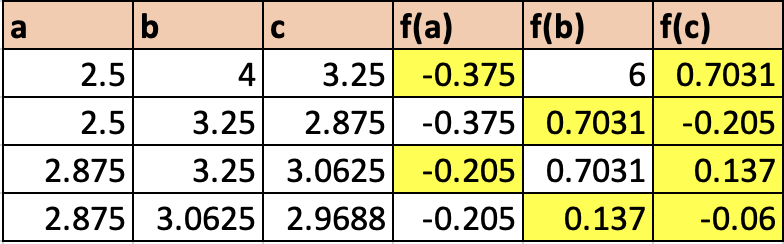
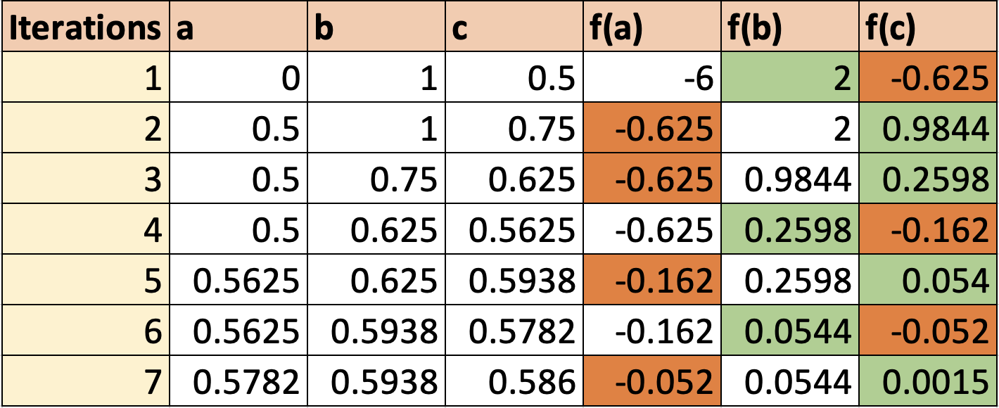
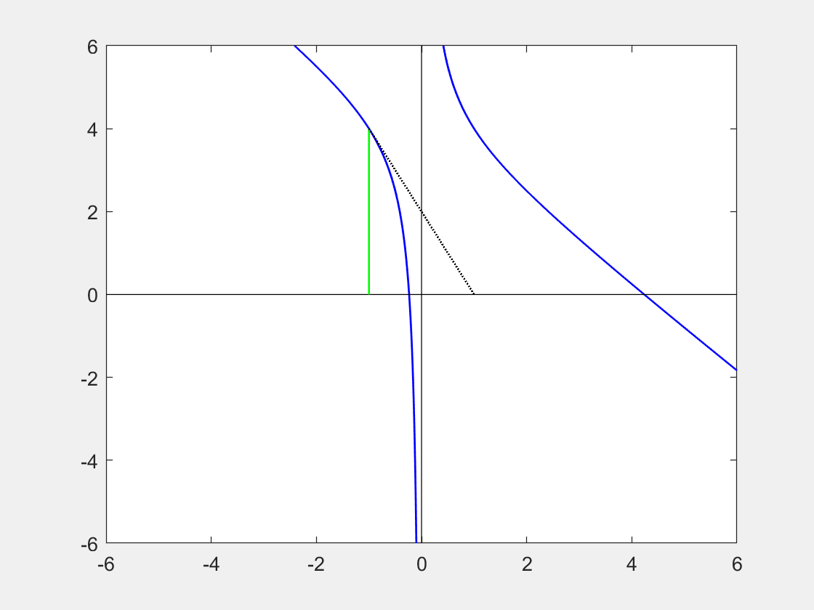

<script type="text/x-mathjax-config">
  MathJax.Hub.Config({
    tex2jax: {
      inlineMath: [ ['$','$'], ["\newline(","\newline)"] ],
      processEscapes: true
    }
  });
</script>

<script type="text/javascript" async
  src="https://cdnjs.cloudflare.com/ajax/libs/mathjax/2.7.5/MathJax.js?config=TeX-MML-AM_CHTML">
</script>
<script type="text/javascript" src="tutorialSheetScripts.js"> </script>
<link rel="stylesheet" type="text/css" media="all" href="styles.css">

# Root Finding Tutorial Sheet, #13

### Additional resources
* [SJC - Newton-Raphson](https://youtu.be/evYOeTyeo1M)
* [SJC - Bisection method](https://www.youtube.com/watch?v=VkyTBij4yoQ)

<br><br><br><br>

# Problem sheet
## Essential Questions
### Problem 1.
Find the positive root of $f(x)=x^3-6x^2+11x-6=0$ using the bisection method from the interval [2.5, 4].

<div class = "answer"> 
These questions could be solved effectively using code (e.g. Python, Matlab), see if you can write the scripts yourself!
<br><br>
Using a table, the highlighted cells (red = negative, green = positive) show the $a$ and $b$ values used for the interval of the next iteration, where $\frac{a + b}{2} = c$. These numbers are chosen for the interval of the following iteration since they have the smallest difference in values and have a negative product.
<br><br>



<br>
It is clear that the iterations are converging towards the root $\boxed{x=3}.$

<br><br>
Alternative Method:
<br>
Finding the interval $[a, b]$ bracketing the root. Since the bisection method finds a root in a given interval $[2.5, 4]$

\begin{aligned}
& (\mathrm{i})\quad f(x) = x^3-6x^2+11x-6\newline
& (\mathrm{ii})\quad a_0=2.5,\quad b_0=4
\end{aligned}

Iteration 1 $(k = 0)$:

\begin{equation*}
c_0 = \frac{a_0+b_0}{2}=\frac{4+2.5}{2}=\frac{6.5}{2}=3.25
\end{equation*}

Since $f(c_0)f(a_0)=f(3.25)f(2.5) < 0$ and $|f(c_0)f(a_0)| < |f(b_0)f(a_0)|$ , set $b_1=c_0=3.25,a_1=a_0=2.5$

Iteration 2 $(k = 1)$:

\begin{equation*}
c_1 = \frac{3.25+2.5}{2}=2.8750
\end{equation*}

Since $f(c_1)f(a_1)=f(2.875)f(2.5)>0$ and $|f(c_1)f(b_1)| < |f(b_1)f(a_1)|$, set $ b_2=b_1=3.25, a_2 = c_1=2.875$

Iteration 3 $(k = 2)$:

\begin{equation*}
c_2=\frac{a_2+b_2}{2}=\frac{2.875+3.25}{2}=3.0625
\end{equation*}

Since $f(c_2)f(a_2)=f(3.0625)f(2.875) < 0$ and $|f(c_2)f(a_2)| < |f(b_2)f(a_2)|$, set $b_3=c_2=3.0625,a_3=a_2=2.875$

Iteration 4 $(k = 3)$:

\begin{equation*}
    c_3=\frac{a_3+b_3}{2}=\frac{2.875+3.0625}{2}=2.9688
\end{equation*}

It is clear that the iterations are converging towards the root $\boxed{x=3}.$

</div>
<div class = "workingout"><br><br><br><br><br><br><br><br></div>

### Problem 2.
The equation $x^3-7x^2+14x-6=0$ has at least one root between $x=0$ and $ x=1$. Use the method of interval bisection to locate this root accurate to $10^{-2}$. 

<div class = "answer">

The bisection method finds a root in a given interval $[0, 1]$

\begin{aligned}
& (\mathrm{i})\quad f(x) = x^3-7x^2+14x-6\newline
& (\mathrm{ii})\quad a_0=0,\quad b_0=1
\end{aligned}

In order to find the number of iterations to the required accuracy:


If we are told a root exists in a certain interval, then we can say that the distance from our current midpoint to the true root (i.e. the "uncertainty") must be less than or equal to half the size of the current interval. We can express this in the following equation for the initial interval $[ a,b ]$, which contains the root $\hat{c}$ and the midpoint $c_n$, where $n$ is our iteration number (i.e. $ \ c_1=\frac{a+b}{2}$).

\begin{equation*}
\left|\hat{c}-c_n\right|\leq\frac{\left|b-a\right|}{2^n}
\end{equation*}

This equation simply expresses the idea that, using the bisection method, our interval will half with each iteration, so the uncertainty will also decrease by a factor of 2.

We can now rearrange this equation to make $n$ the subject:
$$2^n \leq \frac{\left|b-a\right|}{\left|\hat{c}-c_n\right|}$$
$$\log_2{2^n} \leq \log_2{\frac{\left|b-a\right|}{\left|\hat{c}-c_n\right|}}$$
$$n \leq \log_2{\frac{\left|b-a\right|}{\left|\hat{c}-c_n\right|}}$$

If we assume the worst case scenario, then the "$\leq$" becomes an "$=$", which allows us to find $N$, the maximum number of iterations required to achieve a certain bounded error.
\begin{equation*}
N =\log_2{\frac{\left|b-a\right|}{\left|\hat{c}-c_n\right|}}=\log_2\frac{\epsilon_0}{\hat{\epsilon}}
\end{equation*}
where $\epsilon_0$ is your initial interval and $\hat{\epsilon}$ is your desired maximum uncertainty.

For this particular question, the initial interval is $[ 0,1 ]$, so $\epsilon_0=1-0=1$ and the required accuracy is $10^{-2}$ , which means the maximum number of require iterations is $N=\log_2{\frac{1}{10^{-2}}}=6.64...\approx7$

The number of iterations N needed in the bisection method to obtain an accuracy of $\epsilon$ is given by:

\begin{equation*}
N\geq\frac{\log(b_0-a_0)-\log(\epsilon)}{\log2}
\end{equation*}

\begin{equation*}
N\geq\frac{\log(1-0)-\log(10^{-2})}{\log2}\geq\frac{\log(1)+2}{\log2}\geq6.64
\end{equation*}

Thus, a minimum of 7 iterations will be needed to obtain the desired accuracy using the
bisection method. 

Let $a_0=0,b_0=1$ with $f(a_0)<0$, $f(b_0)>0$.

Follow the same iteration process as in problem 1 to find the root to the required accuracy.

\begin{aligned}
& (\mathrm{i})\quad c_0 = \frac{a_0+b_0}{2}=0.5\newline
& (\mathrm{ii})\quad f(c_0)=(0.5)^3-7(0.5)^2+14x-6=-0.625<0
\end{aligned}

Therefore, $a_1=p_0=0.5$,$b_1=b_0=1$ and repeat the iteration: $p_1=0.75$,...
<br>
This yields the following results for $p_n$ and $f(p_n)$:

\begin{align*}
& n& \quad  &c_n&      \quad &f(c_n)   \newline
\hline
& 1&   &0.5000000& &-0.6250000000  \newline
& 2&   &0.7500000& &+0.9843750000  \newline
& 3&   &0.6250000& &+0.2597656250  \newline
& 4&   &0.5625000& &-0.1618652344  \newline
& 5&   &0.5937500& &+0.0540466309  \newline
& 6&   &0.5781250& &-0.0526237488  \newline
& 7&   &0.5859375& &+0.0010313988 \newline
\hline
\end{align*}

Therefore, the root is $\boxed{x = 0.59}$ to 2dp.
<br>
Alternative method:
<br>
We can also use the same method as in problem 1 and use a table to find the root.

<br>

<br>

Therefore, the root is $\boxed{x = 0.59}$ to 2dp.
</div>
<div class = "workingout"><br><br><br><br><br><br><br><br></div>

### Problem 3.
Find the only real root of $x^3-3x-4=0$ using NR method correct to 9 decimal places.

<div class = "answer">
$$
f(x)=x^3-3x-4 \ \ \therefore \ \ f'(x)=3x^2-3
$$

$$
x_{n+1}=x_n-\frac{f(x_n)}{f'(x_n)} \ \ \therefore \ \ x_{n+1}=x_n-\frac{x^3-3x-4}{3x^2-3}
$$

When deciding which points to start with, its important to remember your curve sketching. If functions have turning points or asymptotes, they tend to be quite close to the origin, unless some of the coefficients in the function are very large (e.g. $y=1346x^2-14356x+579$). This suggests that it may often be sensible to start well away from potential "features" of the curve. Let's test some "classic"  points:

\begin{align*}
\mathrm{If}\quad x_0&=-1\quad\mathrm{then}\quad x_1=ERROR \newline
\mathrm{If}\quad x_0&=0\quad\mathrm{then}\quad x_1=-4/3 \newline
\mathrm{If}\quad x_0&=+1\quad\mathrm{then}\quad x_1=ERROR
\end{align*}

What happened above? For the points $x=-1$ and $x=+1$ the iteration could not be evaluated, and this is because we actually started (by mistake) at a turning point, meaning that the gradient at these points was 0. However, if we now take 0 as our starting point, it will still take you 40 iterations before you get a good approximation of the solution... To understand why, you're going to need to sketch the curve. If you had started from -10, you get there in about 16 iterations, if you started from +10, you'd get there in about 6... Even if you started at +1000, it would still only take you 17 iterations.

<br>
<a href = "https://www.wolframalpha.com/input/?i=x%5E3+-+3x+-4+%3D+0">Link to Wolfram Alpha</a>

<br>
The root is $\boxed{x = 2.195823345}$ correct to 9dp. 
<br><br>
Tip: a sensible starting point would have been $ \ x=3 \ $ as well as some of the points mentioned earlier.
</div>
<div class = "workingout"><br><br><br><br><br><br><br><br></div>

### Problem 4.
Find the real root of $x^3-6x^2+9x+1=0$ using;

(a) the Newton-Raphson method.

<div class = "answer">
$$ x_{n+1}=x_n -\frac{f(x_n)}{f'(x_n)} $$

where $f(x_n)=x^3-6x^2+9x+1$, and $f'(x_n) = 3x^2-12x+9$ 

Iterating four times:


\begin{align*}
& n&    &{x_n}&       f&(x_n)&     f'&(x_n)&    (x&_{n+1})&\newline
\hline
%\vspace{0.1cm}
& 0&    & 0&       &1&              &9&       -& \frac{1}{9}& \newline
& 1&    -& \frac{1}{9}&  -&0.07545&  &10.37047&   -&0.10384&   \newline
& 2&   -& 0.10384&  -&0.00033&  &10.27838&          -&0.10380& \newline
& 3&   -& 0.10380&  -&0.00000&     &10.27797&        -&0.10380& \newline
\end{align*}

$\therefore$ the root of the equation is $\boxed{x = -0.1038}$ to 4 dp. 
<br>
To check this, we can substitute this back into the original equation:

\begin{equation*}
    (-0.1038)^{3}-6(-0.1038)^2+9(-0.1038)+1 =0.0000349 \approx 0
\end{equation*}

Alternatively this could be solved using code (e.g. Matlab).

</div>

<div class = "workingout"><br><br><br><br><br><br><br><br></div>

\begin{align*}
& n&    &{x_n} &f &(x_n)& \newline
\hline
& 0&     & 0& &1& \newline
& 1&    -& 1& -&15& \newline
& 2&    -& 0.0625& &0.4138& \newline
& 3&   -& 0.0877& &0.1639& \newline
& 4&   -& 0.1042& -&0.0041& \newline
& 5&   -& 0.1038& &0.0000& \newline
\end{align*}

(b) the Secant method

<div class = "answer">
Using the Secant Formula:

$$
x_{n}=\frac{x_{n-2}f(x_{n-1})-x_{n-1}f(x_{n-2})}{f(x_{n-1})-f(x_{n-2})}
$$

This iterative equation finds the root of the line constructed between the two points - it gets closer to the root with each iteration.

By substituting sequential values of $x_n$ into the formula, we can build the following table:

\begin{align*}
& n&    &{x_n} &f &(x_n)& \newline
\hline
& 0&     & 0& &1& \newline
& 1&    -& 1& -&15& \newline
& 2&    -& 0.0625& &0.4138& \newline
& 3&   -& 0.0877& &0.1639& \newline
& 4&   -& 0.1042& -&0.0041& \newline
& 5&   -& 0.1038& &0.0000& \newline
\end{align*}

You stop iterating if $f(x_n)$ is close enough to 0.
<br>

$\therefore$ the root of the equation is $\boxed{x = -0.1038}$ to 4 dp.
<br>
Alternatively this could be solved using code (e.g. Matlab). An example of the Matlab script is given below (it requires user input rather than editing the script, but you could do it either way).

```matlab:Code
% Secant Method Example Code in MATLAB
 
a=input('Enter function:','s');                %Prompts you to type in equation
f=inline(a)
 
x(1)=input('Enter first point of guess interval: ');    %Prompts you to enter 2 points (x-values)
x(2)=input('Enter second point of guess interval: ');
n=input('Enter allowed Error in calculation: ');        %Prompts you to enter the allowed error
iteration=0;
 
for i=3:1000
   x(i) = x(i-1) - (f(x(i-1)))*((x(i-1) - x(i-2))/(f(x(i-1)) - f(x(i-2)))); %Secant Equation
    iteration=iteration+1;
    if abs((x(i)-x(i-1))/x(i))*100<n
        root=x(i)
        iteration=iteration
        break
    end
end
```
<br>
The root found by these start points will then be returned. (for this question $\boxed{x = -0.1038}$ to 4 dp.)


</div>
<div class = "workingout"><br><br><br><br><br><br><br><br></div>

### Problem 5
Find a positive real root of $\cos(x)-x^3=0$ using;

(a) the NR (Newton-Raphson) method.
<div class = "answer">
Obtaining an initial approximation: 

Since $\mathrm{cos}(x)\leq1$ for all $x$ and for $x > 1, x^3 > 1,$ the positive zero must lie between $0$ and $1$. So, let’s take $x_0 = 0.5$.
<br>
Input Data:

\begin{aligned}
& (\mathrm{i})\quad  f(x) = \mathrm{cos}x-x^3\newline
& (\mathrm{ii})\quad  x_0 = 0.5
\end{aligned}

Formula to be used: $$x_{k+1}=x_k-\frac{f(x_k)}{f'(x_k)}$$


Compute $f'(x)=-\mathrm{sin}x-3x^2$


Iteration 1: $ \ k=0$
$$
x_1=x_0-\frac{f(x_0)}{f'(x_0)}=0.5-\frac{\mathrm{cos}(0.5)-(0.5)^3}{-sin(0.5)-3(0.5)^2}=1.1121
$$

Iteration 2: $ \ k=1$
$$
x_2=x_1-\frac{f(x_1)}{f'(x_1)}=0.9097
$$

Iteration 3: $ \ k=2$ 
$$
x_3=x_2-\frac{f(x_2)}{f'(x_2)}=0.8444
$$

Iteration 4: $ \ k=3$ 
$$
x_4=x_3-\frac{f(x_3)}{f'(x_3)}=0.8659
$$

Iteration 5: $ \ k=4$ 
$$
x_5=x_4-\frac{f(x_4)}{f'(x_4)}=0.8655
$$

Iteration 6: $ \ k=5$ 
$$
x_6=x_5-\frac{f(x_5)}{f'(x_5)}=0.8654
$$

Iteration 7: $ \ k=6$ 
$$
x_7=x_6-\frac{f(x_6)}{f'(x_6)}=0.8654
$$

$\therefore$ the root is $\boxed{x=0.8654}$ to 4 dp.
</div>

<div class = "workingout"><br><br><br><br><br><br><br><br<br><br></div>

(b) the Secant method.

<div class = "answer">
Using the Secant Formula:

$$x_{n}=\frac{x_{n-2}f(x_{n-1})-x_{n-1}f(x_{n-2})}{f(x_{n-1})-f(x_{n-2})}$$   

By substituting sequential values of $x_n$ into the formula, we can build the following table:

\begin{align*}
& n&    &{x_n}&       f&(x_n)& \newline
\hline
& 0&     0.1 & &0.9940&  \newline
& 1&    1& &-0.4597&  \newline
& 2&    0.7154& &0.3887&  \newline
& 3&    0.8458& &0.0581&  \newline
& 4&    0.8687& &-0.0097&  \newline
& 5&    0.8654&	&0.0002&  \newline
\end{align*}

You stop iterating if $f(x_n)$ is close enough to 0.
<br>

$\therefore$ the root of the equation is $\boxed{x=0.8654}$ to 4 dp.
</div>
<div class = "workingout"><br><br><br><br><br><br><br><br></div>

---------------------------------
## Exam Style Questions

### Problem 6.
(i) Use the Newton Raphson method to investigate the function: $ \ f(x) = \frac{1+4x - x^3}{x} \ $ by starting from the point $ \ x = -1.0$.  Find a root accurate to 2 decimal places.

<div class = "answer">

Newton-Raphson formula: $$x_{n+1}=x_n-\frac{f(x_n)}{f'(x_n)}$$

Iteration 1: $ \ n=-1.0$
$$
x_1=x_0-\frac{f(x_0)}{f'(x_0)}=-1-\frac{\frac{1+4(-1) - (-1)^3}{(-1)}}
{\frac{-1}{(-1)^2}-2(-1)}=-3
$$

Iteration 2: $ \ n=-3.0$
$$
x_2=x_1-\frac{f(x_1)}{f'(x_1)}=\frac{-111}{53} = -2.094339623
$$

Iteration 3: $ \ n=-2.09...$ 
$$
x_3=x_2-\frac{f(x_2)}{f'(x_2)}=-1.876262734
$$

Iteration 4: $ \ n=-1.876...$ 
$$
x_4=x_3-\frac{f(x_3)}{f'(x_3)}=-1.86088525
$$

Iteration 5: $ \ n=-1.860...$ 
$$
x_5=x_4-\frac{f(x_4)}{f'(x_4)}=-1.860805855
$$

The root is $\boxed{x=-1.86}$ correct to 2dp. This took 5 iterations.
<br>
Alternatively you could use Matlab or Python code to solve this.

</div>

<div class = "workingout"><br><br><br><br><br><br><br><br></div>

(ii) Sketch the function as well as the path travelled by your NR approximation from the starting location and along each of the subsequent tangents, finishing at the root you have found.

<div class = "answer">



</div>

<div class = "workingout"><br><br><br><br><br><br><br><br></div>
---------------------------------
## Challenging Questions

### Problem 7.
For those who'd like an extra method, look up the ``Fixed point method'' to find the roots for the following function: 

$x-\mathrm{cos}x = 0$ starting from the intervals $0 < x < \frac{\pi}{2}$

<div class = "answer">
From $f(x)=x-\mathrm{cos}(x)$, we obtain $x=\mathrm{cos}(x)$. 
<br>
Thus, if we take $g(x)=\mathrm{cos}(x)$, then:
<br>
(1) For all $x$ in $[ 0,\frac{\pi}{2} ]$, $0\leq g(x)\leq 1$
<br>

(2) $g^{'}(x)=-\mathrm{sin}x$. Thus,$\rvert g^{'}(x)\rvert<1$ in $[ 0,\frac{\pi}{2} ]$
<br>

According to the Fixed-Point Iteration Theorem, the iterations must converge
with any choice of $x_0$ in $[ 0,\frac{\pi}{2} ]$. This is verified from the following computations.
\begin{equation*}
\begin{aligned}
x_0&=0 \newline
x_1&=\mathrm{cos}x_0=1 \newline
x_2&=\mathrm{cos}x_2=0.5403 \newline
x_3&=\mathrm{cos}x_3=0.8576 \newline
.& \newline
.& \newline
.& \newline
x_{17}&=\mathrm{cos}x_4=0.73956 \newline
x_{18}&=\mathrm{cos}x_1=0.73956
\end{aligned}
\end{equation*}
The sequence is clearly converging to the root $\boxed{x\approx 0.74}$

</div>

<div class = "workingout"><br><br><br><br><br><br><br><br></div>

### Problem 8.*

*This is an optional question (requires downloading Matlab and it's symbolic toolbox)

The image below shows Matlab script to find a root to the equation $\frac{1}{x} +4 -x^2$ using the Newton Raphson method. Copy the code into Matlab and fill in the code hidden by '*' so that the code works. Use it to find the root (and use the starting point of 1).

```matlab:Code

function Newton_Raphson_Method
%Implementation of Newton-Raphson method to determine a solution.

i = 1;
**********            %initial conditions (start point)
N = 5;                %maximum number of iterations
error = 0.01;         %precision required

syms 'x'
f(x) = **********     %function we are solving
df = diff(f);         %differential of f(x)

while i <= N
**********            %Newton-Raphson equation 
    
    if (abs(p - p0)/abs(p)) < error   %stopping criterion when difference between iterations is below tolerance
        fprintf('Solution is %f \n', double(p))
        return
    end
 
    i = i + 1;
    p0 = p;            %update p0
end

fprintf('Solution did not converge within %d iterations at a required precision of %d \n', N, error) %error for non-convergence within N iterations

end

```

<div class = "answer" markdown="1">

```matlab:Code
function Newton_Raphson_Method
%Implementation of Newton-Raphson method to determine a solution.

i = 1;
p0 = 1;                      %initial conditions (start point)
N = 5;                       %maximum number of iterations
error = 0.01;                %precision required

syms 'x'
f(x) = (1/x) + 4 -x.^2 ;     %function we are solving
df = diff(f);                %differential of f(x)

  while i <= N
      p = p0 - (f(p0)/df(p0)); %Newton-Raphson equation 
      
      if (abs(p - p0)/abs(p)) < error   %stopping criterion when difference between iterations is below tolerance
          fprintf('Solution is %f \n', double(p))
          return
      end
  
      i = i + 1;
      p0 = p;                   %update p0
  end

fprintf('Solution did not converge within %d iterations at a required precision of %d \n', N, error) %error for non-convergence within N iterations

end
```

The root found was $\boxed{x=2.11}$ to 2dp.
<br>
See if you can write the code yourself for the other root finding methods!
</div>

<div class = "workingout"><br><br><br><br><br><br><br><br></div>

-----------------------------------

## Answers

<button type="button" onclick="displayAnswerButtons('block')">Show answer buttons</button>
<button type="button" onclick="displayAnswers('block')">Show all answers</button>
<button type="button" onclick="displayAnswers('none')">Hide all answers</button>
<br><br>
### For Printing
<button type="button" onclick="prepareForPrint('block')">Add whitespace</button>
<button type="button" onclick="prepareForPrint('none')">Remove whitespace</button>

<br><br>

# Next week, Optimisation!
