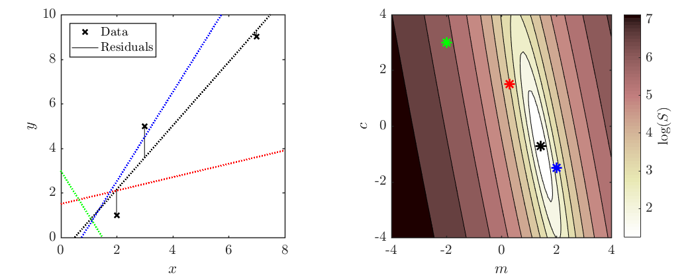
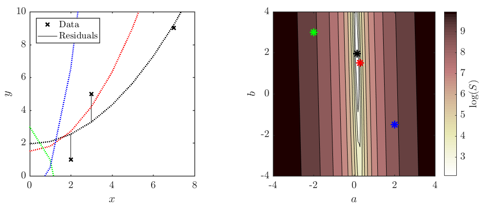
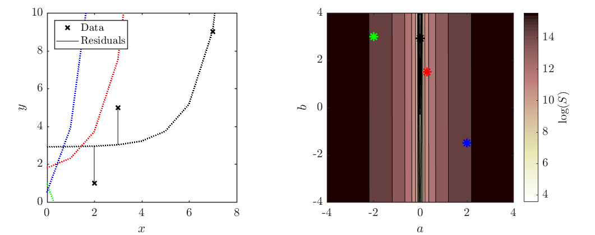
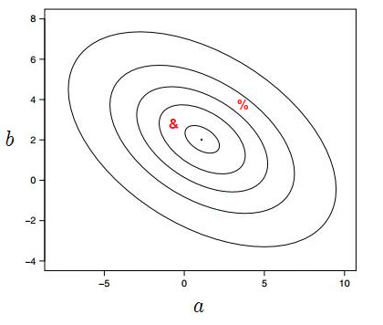
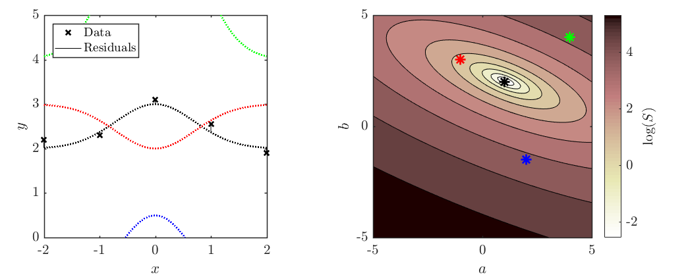

<link rel="stylesheet" type="text/css" media="all" href="styles.css">

# Optimisation Tutorial Sheet, #15

 

In the answers, some wolfram alpha pages are linked in
[blue](https://www.youtube.com/watch?v=dQw4w9WgXcQ) like this
 

# Problem sheet
## Essential Questions
### Problem 1.
Find the line of best fit, using minimised sum squared residuals, of the form $y=mx+c$, through the following three points: (2,1), (3,5) and (7,9). Plot the resulting curve, points and residuals.

Taking the equation for linear regression directly from the notes:

\begin{equation*}
    m = \frac{\sum(x_i-\bar{x})y_i}{\sum(x_i-\bar{x})^2}
\end{equation*}
\begin{equation*}
    c = \bar{y} - m\bar{x}
\end{equation*}

For each of the values that need to be summed or averaged from the points given in the question, we can create a table:

\begin{align*}
& &    &x&       &y&     (x_i&-\bar{x})y_i&    (x_i&-\bar{x})^2& \newline
\hline
& &    &2&       &1&              -&2&       &4& \newline
& &    &3&  &5&  -&5&   &1&   \newline
& &   &7&  &9&  &27&          &9& \newline
& Mean&   & 4&  &5&     & &        & & \newline
& Sum&   & 12&   & 15&   & 20&   & 14& 
\end{align*}

Using these values to calculate $m$ and $c$:
$$
m = \frac{20}{14} = \frac{10}{7} \approx 1.43 \ (3 \ s.f.)
$$

$$
c = 5 - (\frac{10}{7} \times 4) = -\frac{5}{7} \approx -0.714 \ (3 \ s.f.)
$$

$$
\therefore  \boxed{ y = 1.43x - 0.714 }
$$

Additional lines added for the curious.

         

-----------------------------------

### Problem 2.
Find the line of best fit, using minimised sum squared residuals, of the form $y = ax^2 + b$, through the points (2,1), (3,5), and (7,9). Plot the resulting cure, points, and residuals.

This is still a linear regression problem as the function is linear within it's parameters.

$$
S = \sum_{i=1}^{3} (y_i - f(x_i))^2 = \sum_{i=1}^{3} (y_i - ax_i^2 - b)^2
$$

$$
\frac{\partial{}S}{\partial{}a} = 2 \sum_{i=1}^{3} (-x_i^2)(y_i - ax_i^2 - b) = 0 \hspace{2cm} (1)
$$ 

$$
\frac{\partial{}S}{\partial{}b} = 2 \sum_{i=1}^{3} (-1)(y_i - ax_i^2 - b) = 0 \hspace{2cm} (2)
$$

Rearranging:

Using $(1)$,
$$
\sum_{i=1}^{3} (-y_ix_i^2 + ax_i^4 + bx_i^2) = 0,
$$

$$
\therefore \sum_{i=1}^{3} ax_i^4 = -\sum_{i=1}^{3} (-y_ix_i^2 + bx_i^2),
$$

$$
\therefore a = \frac{\sum_{i=1}^{3} (y_ix_i^2 - bx_i^2)}{\sum_{i=1}^{3} (x_i^4)} = \frac{\sum_{i=1}^{3} (y_ix_i^2) - b \sum_{i=1}^{3}(x_i^2)}{\sum_{i=1}^{3} (x_i^4)}
$$

Using $(2)$,
$$
\sum_{i=1}^{3} (y_i - ax_i^2 - b) = 0,
$$

$$
\therefore \sum_{i=1}^{3} b = \sum_{i=1}^{3}(y_i - ax_i^2),
$$

$$
\therefore b = \frac{1}{n} \sum_{i=1}^{3} (y_i) - \frac{a}{n}\sum_{i=1}^{3} (x_i^2)
$$

 

For each of the values that need to be summed or averaged from the points given in the question, we can create a table:
 
\begin{align*}
& &    &x&       &y&     &x_i^4&   &x_i^2&   x&_i^2y_i& \newline
\hline
\newline
& &    &2&   &1&     &16&       &4&   &4& \newline
& &    &3&   &5&     &81&       &9&   &45& \newline
& &    &7&   &9&    &2401&      &49&  &441& \newline
& Mean&   &4&    &5&     & &        & &   & & \newline
& Sum&    &12&   &15&   &2498&   & 62& &490&
\end{align*}

 

$$
a=\frac{490 - 62b}{2498} \ \ \ \therefore 2498a + 62b =490 
$$

$$
b=\frac{1}{3} \times 15 - \frac{a}{3} \times 62 \ \ \ \therefore 62a + 3b = 15
$$

$$
\begin{bmatrix}
2498 & 62 \newline
62 & 3
\end{bmatrix}
\begin{bmatrix}
a \newline
b
\end{bmatrix}
= \begin{bmatrix}
490 \newline
15
\end{bmatrix}
$$

$$
\begin{bmatrix}
a \newline
b
\end{bmatrix}
= \begin{bmatrix}
0.1479 \newline
1.9425
\end{bmatrix}
$$

$$\therefore \boxed{y=0.1479x^2+1.9425}$$

         

-----------------------------------

### Problem 3.
Find the line of best fit, using minimised sum squared residuals, of the form $y=ae^x+b$, through the points (2,1), (3,5) and (7,9). Plot the resulting curve, points and residuals.

This is still a linear regression problem as the function is linear within it's parameters.

$$
S = \sum_{i=1}^{3} (y_i - f(x_i))^2 = \sum_{i=1}^{3} (y_i - ae^{x_i} - b)^2
$$

$$
\frac{\partial{}S}{\partial{}a} = 2 \sum_{i=1}^{3} (-e^{x_i})(y_i - ae^{x_i} - b) = 0 \hspace{2cm} (1)
$$

$$
\frac{\partial{}S}{\partial{}b} = 2 \sum_{i=1}^{3} (-1)(y_i - ae^{x_i} - b) = 0 \hspace{2cm} (2)
$$

Rearranging:

Using $(1)$,

$$
\sum_{i=1}^{3} (-y_ie^{x_i} + ae^{2x_i} + be^{x_i}) = 0,
$$

$$
\therefore a = \frac{\sum_{i=1}^{3} (y_ie^{x_i} - be^{x_i})}{\sum_{i=1}^{3} (e^{2x_i})} = \frac{\sum_{i=1}^{3} (y_ie^{x_i}) - b \sum_{i=1}^{3}(e^{x_i})}{\sum_{i=1}^{3} (e^{2x_i})}
$$

Using $(2)$,

$$
\sum_{i=1}^{3} (y_i - ae^{x_i} - b) = 0,
$$

$$
\therefore b = \frac{1}{n} \sum_{i=1}^{3} (y_i) - \frac{a}{n}\sum_{i=1}^{3} (e^{x_i})
$$

 

For each of the values that need to be summed or averaged from the points given in the question, we can create a table:
 
\begin{align*}
& &    &x&       &y&     &e^{x_i}&   &e^{2x_i}&   e&^{x_i}y_i& \newline
\hline
 \newline
& &    &2&   &1&     &e^2&       &e^4&   &e^2& \newline
& &    &3&   &5&     &e^3&       &e^6&   &5e^3& \newline
& &    &7&   &9&    &e^7&      &e^{14}&  &9e^7& \newline
& Mean&   &4&    &5&     & &        & &   & & \newline
& Sum&    &12&   &15&   &1124&   &1.2 \times 10^6& &9978&
\end{align*}

 

$$
a = \frac{9978 - 1124b}{1.2 \times 10^6} \ \ \ \therefore 1.2 \times 10^6a + 1124b = 9978
$$

$$
b = \frac{1}{3} \times 15 - \frac{a}{3} \times 1124 \ \ \ \therefore 62a + 3b = 1
$$

$$
\begin{bmatrix}
1.2 \times 10^6 & 1124 \newline
1124 & 3
\end{bmatrix}
\begin{bmatrix}
a \newline
b
\end{bmatrix}
= \begin{bmatrix}
9978 \newline
15
\end{bmatrix}
$$

$$
\begin{bmatrix}
a \newline
b
\end{bmatrix}
= \begin{bmatrix}
0.0056 \newline
2.904
\end{bmatrix}
$$

$$\therefore \boxed{y=0.0056e^x+2.904}$$

Additional lines added for the curious.

         

-----------------------------------

### Problem 4.
The following contour plot shows the summed square error, S, for the two-parameter fit to some data for the function $f(x)=ae^{-x^2}+b$.

(a) Make a sketch of the curve corresponding to the best fit parameters suggested by the contour plot.

(b) On the same axis, sketch the curves corresponding to the “\&” and “\%” points from the contour plot.

(c) Add five example data points to your sketch that could reasonably have been responsible for this contour plot.

 
(a) Best fit parameters: $ \ \ y \approx e^{-x^2}+2 \ \ \Rightarrow \boxed{\text{Black line}}$
 
(b) &: $ \ \ y \approx \frac{-1}{2}e^{-x^2}+3 \ \ \Rightarrow \boxed{\text{Red line}} \quad \quad \quad $  %: $ \ \ y \approx 4e^{-x^2}+4 \ \ \Rightarrow \boxed{\text{Green line}}$
 
(c) $ \Rightarrow \boxed{\text{Black crosses}}$

        

-----------------------------------

## Exam Style Questions
### Problem 5.
The following <a href="https://en.wikipedia.org/wiki/Sigmoid_function">sigmoid activation function</a>, $\alpha(x)$, can be found in some artificial neural networks.

$$\alpha(x) = \frac{\omega}{\beta+e^{-x}}$$

Where the “weight”, $w$, and the “bias”, $b$, are adjustable fitting parameters. To train this neuron, an engineer needs to minimise the “cost”, $C$, defined by the function 

$$C(\omega,\beta) = \frac{1}{2n}\sum^n_i{(\alpha(x_i)-y(x_i))^2}$$

Where $y$ is a (very small) dataset containing the three $[x, y]$ points $[0.25, -0.3]$, $[1, 0.5]$ and $[0.8, 2]$. 

(a) Find expressions for the partial derivatives of $C$ with respect to each of the parameters.

Something to keep in mind:

$$\boxed{\frac{\mathrm{d}}{\mathrm{d}x}\sum{f(x)} = \sum{\frac{\mathrm{d}}{\mathrm{d}x}f(x)}}$$

Starting with $\frac{\partial C}{\partial \omega }$ :

$$
\frac{\partial C}{\partial \omega } = \frac{\partial}{\partial \omega }\frac{1}{2n}\sum^n_i{\Big(\alpha(x_i)-y(x_i)\Big)^2} 
$$

$$
= \frac{1}{2n}\sum^n_i{\frac{\partial}{\partial \omega }\Big(\alpha(x_i)-y(x_i)\Big)^2}
$$

Using the method that you want, determine:

$$
\frac{\partial}{\partial \omega }\Big(\frac{\omega }{\beta  +e^{-x_i}}-y(x_i)\Big)^2
$$

Using the chain rule, (inspired by Wolfram Alpha's Step-by-Step solution)

$$
\frac{\partial}{\partial \omega }\Big(\frac{\omega }{\beta  +e^{-x_i}}-y(x_i)\Big)^2 = \frac{\partial u^2}{\partial u} \times \frac{\partial u}{\partial \omega }
$$

where $u = \frac{\omega }{\beta  +e^{-x_i}}-y(x_i)$ and $\frac{\partial u^2}{\partial u} = 2u$
$$
= 2\Bigg(\frac{\omega }{\beta  +e^{-x_i}}-y(x_i)\Bigg)\Bigg(\frac{\partial}{\partial \omega }\Bigg(\frac{\omega }{\beta  +e^{-x_i}}-y(x_i)\Bigg)\Bigg)
$$

Differentiate the sum term by term and factor out constants:

$$
= \Bigg(\frac{\frac{\partial}{\partial \omega }\omega }{\beta  +e^{-x}}+\frac{\partial}{\partial \omega }(-y(x_i))\Bigg)2\Bigg(\frac{\omega }{\beta  +e^{-x_i}}-y(x_i)\Bigg)
$$

The derivative of $\omega $ is 1:
$$
= 2\Bigg(\frac{\omega }{\beta  +e^{-x_i}}-y(x_i)\Bigg)\Bigg(\frac{\partial}{\partial \omega }(-y(x_i))+\frac{1}{\beta  +e^{-x_i}}\Bigg)
$$

Simplify the expression:
$$
= 2 \frac{2(\frac{\omega }{\beta  +e^{-x_i}}-y(x_i))-y(x_i)}{\beta  +e^{-x_i}}
$$

Simplify the expression:
$$
 =-\frac{2e^{x_i}\bigg(y(x_i)+e^{x_i}\Big(-\omega +\beta  y(x_i)\Big)\bigg)}{(1+\beta  e^{x_i})^2}
$$

Substituting back in the $\frac{1}{2n}\sum^n_i$,

$$
\therefore \boxed{\frac{\partial C}{\partial \omega } = -\frac{1}{n}\sum^n_i{\frac{e^{x_i}\bigg(y(x_i)+e^{x_i}\Big(-\omega +\beta  y(x_i)\Big)\bigg)}{(1+\beta  e^{x_i})^2}}}
$$

We can use a similar method for $\frac{\partial C}{\partial \beta  }$, and we end up with:

$$
\therefore \boxed{\frac{\partial C}{\partial \beta  } = -\frac{1}{n}\sum^n_i{\frac{\omega (\frac{\omega }{\beta  +e^{-x_i}}-y(x_i))}{(\beta  +e^{-x_i})^2}}}
$$

Alternatively, the expressions can also be found easily using WolframAlpha:

<a href="https://www.wolframalpha.com/input/?i=+%28%28w%29%2F%28b%2Be%5E-x%29-y%29%5E2+differentiate+wrt+w">Wolfram Alpha: wrt $\omega$</a>
<!-- [Wolfram Alpha: wrt $\omega$](https://www.wolframalpha.com/input/?i=+%28%28w%29%2F%28b%2Be%5E-x%29-y%29%5E2+differentiate+wrt+w) -->

<a href="https://www.wolframalpha.com/input/?i=+%28%28w%29%2F%28b%2Be%5E-x%29-y%29%5E2+differentiate+wrt+b">Wolfram Alpha: wrt $\beta$</a>
<!-- [Wolfram Alpha: wrt $\beta$](https://www.wolframalpha.com/input/?i=+%28%28w%29%2F%28b%2Be%5E-x%29-y%29%5E2+differentiate+wrt+b) -->

         

(b) Calculate a Jacobian vector of the cost function, $\vec{J_C}$, at the initial point $\omega=1$ and $\beta=0$.

$$
\vec{J_C} = \Bigg[\frac{\partial C}{\partial \omega}, \frac{\partial C}{\partial \beta}\Bigg]
$$

 
An easy way to calculate the Jacobian vector is using a table like the one below:
  

|  |  | wrt $\omega$ | wrt $\beta$ |
|-|-|-|-|
| $x$ | $y(x)$ | $\frac{e^{x}(y(x)+e^{x}(-\omega + \beta y(x)}{(1+\beta e^{x})^2}$ | $\frac{\omega (\frac{\omega}{\beta + e^{-x}}-y(x))}{(\beta + e^{-x_i})^2}$ |
| 0.25 | -0.3 | <a href="https://www.wolframalpha.com/input/?i=%28e%5Ex%28y%2Be%5Ex%28-w%2Bb*y%29%29%29%2F%281%2Bb*e%5Ex%29%5E2+with+x%3D0.5%2C+y%3D-0.3%2C+w%3D1%2C+b%3D0">-3.2129</a> | <a href="https://www.wolframalpha.com/input/?i=%28w%28%28w%2F%28b%2Be%5E-x%29%29-y%29%29%2F%28b%2Be%5E-x%29%5E2+with+x+%3D+0.25%2C+y%3D-0.3%2C+w%3D1%2C+b%3">2.61162</a> |
| 1 | 0.5 | <a href="https://www.wolframalpha.com/input/?i=%28e%5Ex%28y%2Be%5Ex%28-w%2Bb*y%29%29%29%2F%281%2Bb*e%5Ex%29%5E2+with+x%3D1%2C+y%3D0.5%2C+w%3D1%2C+b%3D0">-6.02992</a> | <a href="https://www.wolframalpha.com/input/?i=%28w%28%28w%2F%28b%2Be%5E-x%29%29-y%29%29%2F%28b%2Be%5E-x%29%5E2+with+x+%3D+1%2C+y%3D0.5%2C+w%3D1%2C+b%3D0">16.391</a> |
| 0.8 | 2 | <a href="https://www.wolframalpha.com/input/?i=%28e%5Ex%28y%2Be%5Ex%28-w%2Bb*y%29%29%29%2F%281%2Bb*e%5Ex%29%5E2+with+x%3D0.8%2C+y%3D2%2C+w%3D1%2C+b%3D0">-0.501951</a> | <a href="https://www.wolframalpha.com/input/?i=%28w%28%28w%2F%28b%2Be%5E-x%29%29-y%29%29%2F%28b%2Be%5E-x%29%5E2+with+x+%3D+0.8%2C+y%3D2%2C+w%3D1%2C+b%3D0">1.11711</a> |
| $-\frac{1}{n}\sum^n_i$ | (mean of negatives) | 3.248257 | -6.70658 |

Note: the blue numbers are links which will show you how the number was calculated using WolframAlpha!
 

$$
\therefore \boxed{\vec{J_C} = \Big[3.248, \hspace{2mm} -6.707\Big]}
$$

         

(c) Suggest whether $\omega$ and $\beta$ should be increased or decreased to improve the fit, explaining your answer. 

To improve the fit, you need to go the direction of steepest descent, meaning $-\vec{J}$ because the Jacobian points towards the maxima.

$\Rightarrow \boxed{\omega \text{ needs to be decreased and }\beta \text{ needs to be increased.}}$

         

-----------------------------------

### Problem 6. 

Considering another function
$$\gamma(x) = \frac{ax}{e^x+b}$$

Where $a$ and $b$ are adjustable parameters. The "cost", $C$, defined by the function

$$
C(a,b) = \frac{1}{2n}\sum^n_i(\gamma(x_i)-y(x_i))^2
$$

Where $y$ is a database containing the three $[x,y]$ points 
$[1,3.4]$, $[-2.3,0.5]$, $[2.2,-3]$, $[4.7,-6]$

(a) Find expressions for the partial derivatives of $C$ with respect to each of the parameters.

Starting with $\frac{\partial}{\partial a }$:
 

$$
\frac{\partial C}{\partial a} = \frac{\partial}{\partial a}\frac{1}{2n}\sum^n_i{\Big(\gamma(x_i)-y(x_i)\Big)^2} 
$$

$$
= \frac{1}{2n}\sum^n_i{\frac{\partial}{\partial a }\Big(\gamma(x_i)-y(x_i)\Big)^2}
$$

Using the method that you want, determine:

$$\frac{\partial}{\partial a }\Big(\frac{ax_i }{e^{x_i}+b}-y(x_i)\Big)^2 = -\frac{2x_i(y(x_i)(b+e^{x_i})-ax_i)}{(b+e^{x_i})^2}$$
 
Note: this can be solved easily on WolframAlpha.
<a href="https://www.wolframalpha.com/input/?i=%28%28ax%29%2F%28e%5Ex%2Bb%29-y%29%5E2+differentiate+wrt+a">Link</a>

$$
\frac{\partial C}{\partial a} = \frac{1}{2n}\sum^n_i -\frac{2x_i(y(x_i)(b+e^{x_i})-ax_i)}{(b+e^{x_i})^2}
$$

$$
\therefore \boxed{\frac{\partial C}{\partial a} = -\frac{1}{n}\sum^n_i \frac{x_i(y(x_i)(b+e^{x_i})-ax_i)}{(b+e^{x_i})^2}}
$$

 
Next, solving $\frac{\partial}{\partial b }$ in a similar way:
 

$$\frac{\partial}{\partial b }\Big(\frac{ax_i }{e^{x_i}+b}-y(x_i)\Big)^2 =-\frac{2ax_i(ax_i-y(x_i)(b+e^{x_i}))}{(b+e^{x_i})^3}$$
 
Note: this can be solved easily on WolframAlpha.
<a href="https://www.wolframalpha.com/input/?i=%28%28ax%29%2F%28e%5Ex%2Bb%29-y%29%5E2+differentiate+wrt+b">Link</a>

$$
\therefore \boxed{\frac{\partial C}{\partial b} = \frac{ax_i(ax_i-y(x_i)(b+e^{x_i}))}{(b+e^{x_i})^3}}
$$

         

(b) Calculate a Jacobian vector of the cost function, $\vec{J_C}$, at the initial point $a=0.5$ and $b=-0.5$.

$$
\vec{J_C} = \Bigg[\frac{\partial C}{\partial \omega}, \frac{\partial C}{\partial \beta}\Bigg]
$$

 
An easy way to calculate the Jacobian vector is using a table like the one below:
  

|  |  | wrt $a$ | wrt $b$ |
|-|-|-|-|
| $x$ | $y(x)$ | $\frac{x_i(y(x_i)(b+e^{x_i})-ax_i)}{(b+e^{x_i})^2}$ | $\frac{ax_i(ax_i-y(x_i)(b+e^{x_i}))}{(b+e^{x_i})^3}$ |
| 1 | 3.4 | <a href="https://www.wolframalpha.com/input/?i=-%282x%28y%28b%2Be%5Ex%29-ax%29%29%2F%28b%2Be%5Ex%29%5E2+with+a%3D0.5%2C+b%3D-0.5%2C+x%3D1%2C+y%3D3.4">-2.862</a> | <a href="https://www.wolframalpha.com/input/?i=-%282ax%28ax-y%28b%2Be%5Ex%29%29%29%2F%28b%2Be%5Ex%29%5E3+with+a%3D0.5%2C+b%3D-0.5%2C+x+%3D+1%2C+y%3D3.4">0.645</a> |
| -2.3 | 0.5 | <a href="https://www.wolframalpha.com/input/?i=-%282x%28y%28b%2Be%5Ex%29-ax%29%29%2F%28b%2Be%5Ex%29%5E2+with+a%3D0.5%2C+b%3D-0.5%2C+x%3D-2.3%2C+y%3D0.5">27.35</a> | <a href="https://www.wolframalpha.com/input/?i=-%282ax%28ax-y%28b%2Be%5Ex%29%29%29%2F%28b%2Be%5Ex%29%5E3+with+a%3D0.5%2C+b%3D-0.5%2C+x+%3D+-2.3%2C+y%3D0.5">34.21</a> |
| 2.2 | -3 | <a href="https://www.wolframalpha.com/input/?i=-%282x%28y%28b%2Be%5Ex%29-ax%29%29%2F%28b%2Be%5Ex%29%5E2+with+a%3D0.5%2C+b%3D-0.5%2C+x%3D2.2%2C+y%3D-3">1.615</a> | <a href="https://www.wolframalpha.com/input/?i=-%282ax%28ax-y%28b%2Be%5Ex%29%29%29%2F%28b%2Be%5Ex%29%5E3+with+a%3D0.5%2C+b%3D-0.5%2C+x+%3D+2.2%2C+y%3D-3">-0.095</a> |
| 4.7 | -6 | <a href="https://www.wolframalpha.com/input/?i=-%282x%28y%28b%2Be%5Ex%29-ax%29%29%2F%28b%2Be%5Ex%29%5E2+with+a%3D0.5%2C+b%3D-0.5%2C+x%3D4.7%2C+y%3D-6">0.5172</a> | <a href="https://www.wolframalpha.com/input/?i=-%282ax%28ax-y%28b%2Be%5Ex%29%29%29%2F%28b%2Be%5Ex%29%5E3+with+a%3D0.5%2C+b%3D-0.5%2C+x+%3D+4.7%2C+y%3D-6">-0.002</a> |
| $-\frac{1}{n}\sum^n_i$ | (mean of negatives) | -6.655 | -8.690 |

Note: the blue numbers are links which will show you how the number was calculated using WolframAlpha!
 

$$
\therefore \boxed{\vec{J_C} = \Big[-6.655, \hspace{2mm} -8.690\Big]}
$$

         

(c) Suggest whether $\omega$ and $\beta$ should be increased or decreased to improve the fit, explaining your answer. 

To improve the fit, you need to go the direction of steepest descent, meaning $-\vec{J}$ because the Jacobian points towards the maxima (steepest ascent).

$\Rightarrow \boxed{a \text{ and }b \text{ need to be increased.}}$

         

-----------------------------------

## Challenging Questions
### Problem 7.
<!-- Should I just make it the same question but with a larger data set? Or with additional parameters -->

__Machine Learning!__

When data sets are huge, [Stochastic Gradient Descent](https://www.youtube.com/watch?v=vMh0zPT0tLI) can be used to find a local minimum faster. Instead of taking the sum of all data points to calculate a Jacobian (-gradient):
1. Take a (random) data point
2. Calculate the gradient
3. Update the weights using the gradient * learning rate
4. Repeat 1-3 with all data points

The method is advantageous as it makes the cost function converge faster when the dataset is large as it causes updates to the parameters more frequently.

Considering the following function

$$
\sigma(x) = \tan^2(ax+b)
$$

Where $a$ and $b$ are variable 'weights'. To determine the optimized values for these weights, the cost function $C$ needs to be minimized. $C$ is defined by 

$$
C(a,b) = \frac{1}{2}\Big(\sigma(x)-y(x)\Big)^2
$$

Where y is a dataset containing the three $[x,y]$ points $[-3,4], [2.5,6], [0.3,4.3]$ and the learning rate is $0.25$

(a) Determine the Jacobian vector of the cost function.

$$
\vec{J_C} = \Bigg[\frac{\partial C}{\partial a}, \frac{\partial C}{\partial b}\Bigg]
$$

$$
\frac{\partial C}{\partial a} = \frac{\partial}{\partial a} \Big(\tan^2(ax+b)-y(x)\Big)^2
$$

<a href="https://www.wolframalpha.com/input/?i=differentiate+%281%2F2%29%28tan%5E2%28ax%2Bb%29-y%29%5E2+wrt+a">$$= 2x\tan(ax+b)sec^2(ax+b)\Big(\tan^2(ax+b)-y\Big)^2$$</a>

$$
\frac{\partial C}{\partial b} = \frac{\partial}{\partial b} \Big(\tan^2(ax+b)-y(x)\Big)^2
$$

<a href="https://www.wolframalpha.com/input/?i=differentiate+%281%2F2%29%28tan%5E2%28ax%2Bb%29-y%29%5E2+wrt+b">$$= 2\tan(ax+b)sec^2(ax+b)\Big(\tan^2(ax+b)-y\Big)^2$$</a>

$$
\boxed{\vec{J_C} = \Bigg[2x\tan(ax+b)sec^2(ax+b)\Big(\tan^2(ax+b)-y\Big)^2, \hspace{4mm} 2\tan(ax+b)sec^2(ax+b)\Big(\tan^2(ax+b)-y\Big)^2\Bigg]}
$$

         

(b) With the initial guess of $a = 1$ and $b=1$, determine the new weights using the first data point $[-3,4]$

$\vec{J_C} = \Big[$
<a href="https://www.wolframalpha.com/input/?i=2*r*x*tan%28a*x%2Bb%29*sec%5E2%28a*x%2Bb%29%28tan%5E2%28a*x%2Bb%29-y%29%5E2+with+x+%3D+-3%2C+y%3D4%2C+a%3D1%2C+b%3D1%2C+r%3D0.25">-11.350</a> , <a href="https://www.wolframalpha.com/input/?i=2*r*tan%28a*x%2Bb%29*sec%5E2%28a*x%2Bb%29%28tan%5E2%28a*x%2Bb%29-y%29%5E2+with+x+%3D+-3%2C+y%3D4%2C+a%3D1%2C+b%3D1%2C+r%3D0.25">    3.783</a>
$\Big]$

Plug in all the variables into the Jacobian: a, b, x, y, r
(r corresponds to the learning rate)

To minimize cost, you need to go in the direction of steepest descent ($-\vec{J_C}$)

$$
\boxed{a = 12.350 \text{ and } b = -2.783}
$$

         

(c) Determine the new weights using the second data point $[2.5,6]$

$\vec{J_C} = \Big[$
<a href="https://www.wolframalpha.com/input/?i=2*r*x*tan%28a*x%2Bb%29*sec%5E2%28a*x%2Bb%29%28tan%5E2%28a*x%2Bb%29-y%29%5E2+with+x+%3D+2.5%2C+y%3D6%2C+a%3D12.35%2C+b%3D-2.783%2C+r%3D0.25">-8.482</a> , <a href="https://www.wolframalpha.com/input/?i=2*r*tan%28a*x%2Bb%29*sec%5E2%28a*x%2Bb%29%28tan%5E2%28a*x%2Bb%29-y%29%5E2+with+x+%3D+2.5%2C+y%3D6%2C+a%3D12.35%2C+b%3D-2.783%2C+r%3D0.25">    -3.392</a>
$\Big]$

$$
\boxed{a = 20.832 \text{ and } b = 0.609}
$$

         

(d) Determine the new weights using the second data point $[0.3,4.3]$

$\vec{J_C} = \Big[$
<a href="https://www.wolframalpha.com/input/?i=2*r*x*tan%28a*x%2Bb%29*sec%5E2%28a*x%2Bb%29%28tan%5E2%28a*x%2Bb%29-y%29%5E2+with+x+%3D+0.3%2C+y%3D4.3%2C+a%3D20.832%2C+b%3D0.609%2C+r%3D0.25">2.080</a> , <a href="https://www.wolframalpha.com/input/?i=2*r*tan%28a*x%2Bb%29*sec%5E2%28a*x%2Bb%29%28tan%5E2%28a*x%2Bb%29-y%29%5E2+with+x+%3D+0.3%2C+y%3D4.3%2C+a%3D20.832%2C+b%3D0.609%2C+r%3D0.25">    6.934</a>
$\Big]$

$$
\boxed{a = 18.752 \text{ and } b = -6.325}
$$

        

## Answers

<button type="button" onclick="displayAnswerButtons('block')">Show answer buttons</button>
<button type="button" onclick="displayAnswers('block')">Show all answers</button>
<button type="button" onclick="displayAnswers('none')">Hide all answers</button>
  
### For Printing
<button type="button" onclick="prepareForPrint('block')">Add whitespace</button>
<button type="button" onclick="prepareForPrint('none')">Remove whitespace</button>

  

# Next week, the Normal Distribution!
