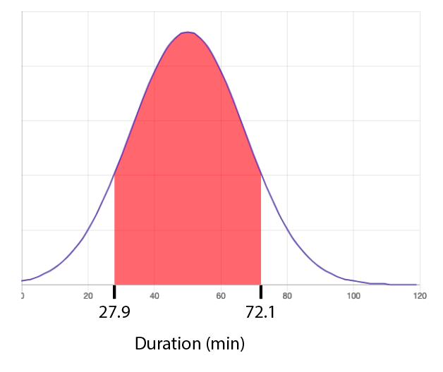
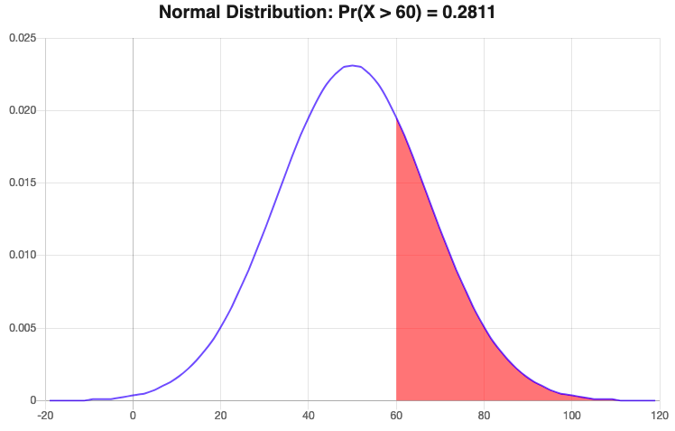
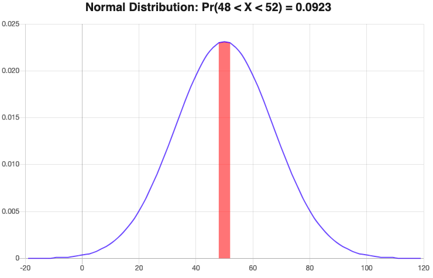

<link rel="stylesheet" type="text/css" media="all" href="styles.css">

# Normal Distribution Tutorial Sheet, #16

This particular tutorial sheet is short. Do not be alarmed! It reflects the low difficulty of the topic. 

### Additional resources
* [SJC - The Gaussian](https://youtu.be/26QbWYBCw7Y)

    

# Problem sheet
## Essential Questions
### Problem 1.
Alex took a test and scored 940. The mean score was 850 with the standard deviation of 100.

(a) Draw a Gaussian/Bell Curve for this Data and highlight area higher than Alex's score. Include all given information on the diagram.

(b) If there were a total of 200 students taking the test, how many would be expected to get a higher mark than Alex?

$\Rightarrow{} P(X>940)=1 - \left[\frac{1}{2} \left(1 + \text{ erf}\ \left(\frac{\ 940\ -\ 850}{100\ \sqrt{2}} \right)\right)\right]$  

$\Rightarrow{} P(X>940)=1-0.81594=0.18406$  

$\Rightarrow{} 0.18406\times 200=36.81$ students  

$\Rightarrow{}$ rounding down: $\boxed{\text{ only 36 students are expected to be higher }}$  

(c) If the failing mark for this test was 600, how many of the 200 students would be expected to failed the test? Show this on your diagram

$ \Rightarrow{} P(X < 600)=\left[\frac{1}{2} \left(1 + \text{ erf}\ \left(\frac{\ 600\ -\ 850}{100\ \sqrt{2}} \right)\right)\right] $
 

$ \Rightarrow{} P(X < 600)=0.006=0.6\% $
 

$ \Rightarrow{} \boxed{ 1 \text{ Student} }$

 

        

-----------------

### Problem 2.
According to a survey from 100 undergraduate students, only 5 students were graduated with a grade above 70%. If the average student grade was 55%:

(a) Draw a Gaussian/Bell Curve for the given Data.

(b) Using the given data, find the standard deviation for the graduation grades.

$ \Rightarrow{} P(X>70)=[\frac{1}{2}{({1{-{ \text{ erf}\ {(\frac{\ 70\ -\ 55}{\sigma\ \sqrt{2}})}}}}}]=5\% $  

$ \Rightarrow{} P(X>70)={0.5{ \text{erf}{(\frac{\ 70\ -\ 55}{\sigma\ \sqrt{2}})}}}=0.45 $  

$ \Rightarrow{} \text{ erf}(x) =0.9 $  

$ \Rightarrow{} \text{ tanh}(1.2x) =0.9 $  

$ \Rightarrow{} x={(\frac{\ 70\ -\ 55}{\sigma\ \sqrt{2}})}=1.227 $  

$ \Rightarrow{} \boxed{ SD = \sigma =8.64}$

(c) If the failing grade is to be 40%, how many students would possibly fail the course? Show this on the diagram as well.

$\Rightarrow{} P(X < 40)=\frac{1}{2}{\left({1{+{\text{ erf}\ {\left(\frac{\ 40\ -\ 55}{8.64\ \sqrt{2}}\right)}}}}\right)} $

$\Rightarrow{} P(X<40)=0.049=5% $  

$\Rightarrow{} \boxed{ 5 \text{ Students}}$  

(d) How many students would be expected to pass the course below 60%? Add this to your diagram.

$ \Rightarrow{} P(40< X < 60)=P(X < 60)-P(X < 40)  $ 
 
$ \Rightarrow{} P(40 < X < 60)= \frac{1}{2}\left[\text{ erf}\left(\frac{60-55}{8.64\ \sqrt{2}}\right)- \text{ erf}\left(\frac{40-55}{8.64\ \sqrt{2}}\right)\right] $ 
 
$ \Rightarrow{} P(40 < X < 60)=0.678=68 \%  $ 
 
$ \Rightarrow{} \boxed{68\ \text{ Students}}$  

        

-----------------

### Problem 3.
A Packing plant fills bags with cement. The mean weight of these bags is 50kg with standard deviation of 4kg.

(a) Draw a Gaussian/Bell Curve for the given Data.

(b) Find the probability of bags exceeding 53kg.

$ \Rightarrow{} P(X>53)= 1 - \left[\frac{1}{2} \left( 1 + \text{ erf}\ \left(\frac{\ 53\ -\ 50}{4\ \sqrt{2} }\right) \right) \right] $  

$ \Rightarrow{} \boxed{ P(X>53)= 0.23=23 \\% }$ 

(c) Find the weight that is exceeded by 82% of the bags.

$ \Rightarrow{} P(X>Y)=[\frac{1}{2}{({1{-{\text{ erf}\ {(\frac{\ Y\ -\ 50}{4\ \sqrt{2}})}}}})}]=82\% $  

$ \Rightarrow{} P(X>Y)=0.32={ {-\frac{1}{2}}{\text{ erf}(x)}} $  

$ \Rightarrow{} \text{ tanh}(1.2x) =-0.64 $  

$ \Rightarrow{} x={(\frac{\ Y\ -\ 50}{\ 4\ \sqrt{2}})}=-0.63 $  

$ \Rightarrow{} \boxed{ \text{ Weight } =46.43 }$  

(d) Three bags were randomly selected. Find the probability that two bags weigh more than 53kg and one weighs less than 53kg.

$\Rightarrow{} P(X>53)=23\% $ and $P(X < 53)=77\%$  
$\Rightarrow{} \text{ Probability } =P ( X>53)\times\ P(X>53)\times\ P(X < 53)= 0.23\times\ 0.23\times\ 0.77$  
$\Rightarrow{} \boxed{ \text{Probability} = 4 \% }$ 

        

-----------------

### Problem 4.
A high-Jumper can clear a jump higher than 1.78m once in every five attempts. This jumper can also clear a height of at least 1.65m on 7 out of 10 attempts:

(a) Draw a Gaussian/Bell Curve for the given Data with highlighting the jumps over 1.78. 

(b) Find the mean and the standard deviation of the heights the athlete can reach.

$ \Rightarrow{} P(X>1.78)={1-[\frac{1}{2}{({1{+{\text{ erf} \ {(\frac{\ 1.78\ -\ \alpha}{\sigma\ \sqrt{2}})}}}})}]}=20\%$  

$ \Rightarrow{} 0.3={\frac{1}{2}{( \text{ tanh}(1.2x))}}$  

$ \Rightarrow{} x=0.57={(\frac{\ 1.78\ -\sigma}{\alpha\ \sqrt{2}})}$  

$ \Rightarrow{} \alpha={ {(1.78)}-{(\sigma\times\ 0.57\times\ \sqrt{2})}}$  

$ \Rightarrow{} \text{ also  } P(X>1.65)={1-[\frac{1}{2}{({1{+{ \text{ erf}\ {(\frac{\ 1.65\ -\ \alpha}{\sigma\ \sqrt{2}})}}}})}]}=70\%$  

$ \Rightarrow{} \alpha={ {(1.65)}-{(\sigma\times\ (-0.35)\times\ \sqrt{2})}}$  

$ \Rightarrow{} { {(1.78)}-{(\sigma\times\ 0.57\times\ \sqrt{2})}}={ {(1.65)}-{(\sigma\times\ (-0.35)\times\ \sqrt{2})}}$  

$ \Rightarrow{} 1.78-1.65={(\sigma\times\ \sqrt{2})\times\ {(0.35+0.57)}}$  

$ \Rightarrow{} \boxed{ \sigma = \frac{0.13}{\sqrt{2}\times\ 0.92}=0.1m }$  

$ \Rightarrow{} \alpha={ {(1.78)}-{(0.1\times\ 0.57\times\ \sqrt{2})}}$  

$ \Rightarrow{} \boxed{ \alpha=1.7m }$

        

## Exam Questions

### Problem 5.
Due to imperfect manufacturing of circuit laundry machines, their wash times can vary. The machine displays a time of 50 minutes for colors at $40 ^\circ $ but truly has a standard deviation of 17 minutes and 15 seconds around that time. 

(a) Sketch a graph of the wash time for colors at $40 ^\circ $ distribution. Shade the region showing the 80% most reliable wash times and label the duration interval.

Most reliable wash times are around the mean (50 min) interval corresponds to everything but the extreme 10% (upper and lower). 

Upper 10%:

$ \Rightarrow{} P(X>Y)=[\frac{1}{2}{({1{-{\text{ erf}\ {(\frac{\ Y\ -\ 50}{17.25\ \sqrt{2}})}}}})}]=10\% $ 

Solve for Y:

[$ Y = 72.1$](https://www.wolframalpha.com/input/?i=0.5%281-erf%28%28y-50%29%2F%2817.25*sqrt%282%29%29%29%29+%3D+0.1+solve+y) 

Lower 10%:

$ \Rightarrow{} P(X>Y)=[\frac{1}{2}{({1{+{\text{ erf}\ {(\frac{\ Y\ -\ 50}{17.25\ \sqrt{2}})}}}})}]=10\% $ 

[$ Y = 27.9$](https://www.wolframalpha.com/input/?i=0.5%281%2Berf%28%28y-50%29%2F%2817.25*sqrt%282%29%29%29%29+%3D+0.1+solve+y) 

(b) If Imperial College London buys an army of 12 laundry machines for the entirety of Southside Halls and its 350 students, how many of the machines can be expected to have a wash time of more than 60 minutes?

$ \Rightarrow{} P(X>60)=[\frac{1}{2}{({1{-{\text{ erf}\ {(\frac{\ 60\ -\ 50}{17.25\ \sqrt{2}})}}}})}]=0.2811\% $ 

$ 12 * 0.2811 = 3.37 $

$\boxed{3 \text{ machines}}$

(c) How many of the machines have an accuracy of $\pm2$ min with their colors at $40 ^\circ $ cycles?

$ \Rightarrow{} P(48< X < 52)=P(X < 52)-P(X < 48)  $ 
 

$ \Rightarrow{} P(48 < X < 52)= \frac{1}{2}\left[\text{ erf}\left(\frac{52-50}{17.25\ \sqrt{2}}\right)- \text{ erf}\left(\frac{48-50}{17.25\ \sqrt{2}}\right)\right] $ 
 

$ \Rightarrow{} P(48 < X < 52)=0.0923$ 
 

$\Rightarrow{}0.0923*12 = 1.1076$

$ \Rightarrow{} \boxed{1\ \text{ machine}}$  

        

-----------------

## Answers

<button type="button" onclick="displayAnswerButtons('block')">Show answer buttons</button>
<button type="button" onclick="displayAnswers('block')">Show all answers</button>
<button type="button" onclick="displayAnswers('none')">Hide all answers</button>
  
### For Printing
<button type="button" onclick="prepareForPrint('block')">Add whitespace</button>
<button type="button" onclick="prepareForPrint('none')">Remove whitespace</button>

  

# The end :) Enjoy your easter break!