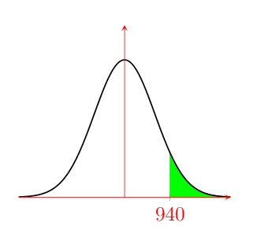
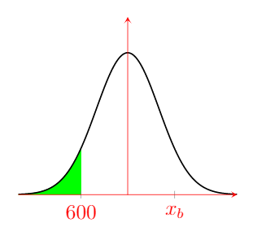
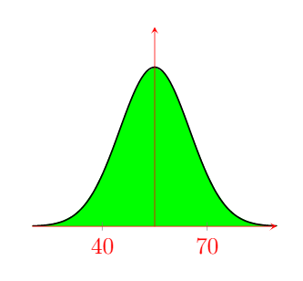
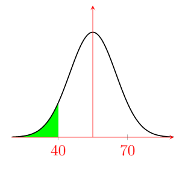
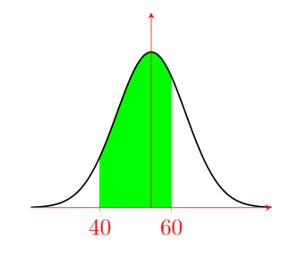
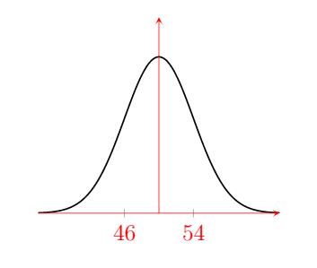
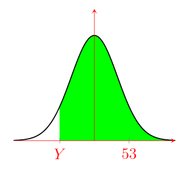
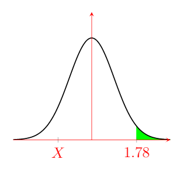

<link rel="stylesheet" type="text/css" media="all" href="styles.css">

# Normal Distribution Tutorial Sheet, #16

### Additional resources
* [SJC - The Gaussian](https://youtu.be/26QbWYBCw7Y)

    

# Problem sheet
## Essential Questions
### Problem 1.
Alex took a test and scored 940. The mean score was 850 with the standard deviation of 100.

(a) Draw a Gaussian/Bell Curve for this Data and highlight area higher than Alex's score. Include all given information on the diagram.

(b) If there were a total of 200 students taking the test, how many would be expected to get a higher mark than Alex?

$\Rightarrow{} P(X>940)=1 - \left[\frac{1}{2} \left(1 + \text{ erf}\ \left(\frac{\ 940\ -\ 850}{100\ \sqrt{2}} \right)\right)\right]$

$\Rightarrow{} P(X>940)=1-0.81594=0.18406$

$\Rightarrow{} 0.18406\times 200=36.81$ students

$\Rightarrow{}$ rounding down: $\boxed{\text{ only 36 students are expected to be higher }}$

(c) If the failing mark for this test was 600, how many of the 200 students would be expected to failed the test? Show this on your diagram

$ \Rightarrow{} P(X < 600)=\left[\frac{1}{2} \left(1 + \text{ erf}\ \left(\frac{\ 600\ -\ 850}{100\ \sqrt{2}} \right)\right)\right] $

$ \Rightarrow{} P(X < 600)=0.006=0.6\% $

$ \Rightarrow{} \boxed{ 1 \text{ Student} }$

-----------------

### Problem 2.
According to a survey from 100 undergraduate students, only 5 students were graduated with a grade above 70\%. If the average student grade was 55\%:

(a) Draw a Gaussian/Bell Curve for the given Data.

(b) Using the given data, find the standard deviation for the graduation grades.

70)=[\frac{1}{2}{({1{-{ \text{ erf}\ {(\frac{\ 70\ -\ 55}{\sigma\ \sqrt{2}})}}}}}]=5\% $

$ \Rightarrow{} P(X>70)={0.5{ \text{erf}{(\frac{\ 70\ -\ 55}{\sigma\ \sqrt{2}})}}}=0.45 $

$ \Rightarrow{} \text{ erf}(x) =0.9 $

$ \Rightarrow{} \text{ tanh}(1.2x) =0.9 $

$ \Rightarrow{} x={(\frac{\ 70\ -\ 55}{\sigma\ \sqrt{2}})}=1.227 $

$ \Rightarrow{} \boxed{ SD = \sigma =8.64}$

(c) If the failing grade is to be 40\%, how many students would possibly fail the course? Show this on the diagram as well.

$\Rightarrow{} P(X < 40)=\frac{1}{2}{\left({1{+{\text{ erf}\ {\left(\frac{\ 40\ -\ 55}{8.64\ \sqrt{2}}\right)}}}}\right)} $

$\Rightarrow{} P(X<40)=0.049=5 \\% $

$\Rightarrow{} \boxed{ 5 \text{ Students}}$

(d) How many students would be expected to pass the course below 60\%? Add this to your diagram.

$ \Rightarrow{} P(40< X < 60)=P(X < 60)-P(X < 40)  $

$ \Rightarrow{} P(40 < X < 60)= \frac{1}{2}\left[\text{ erf}\left(\frac{60-55}{8.64\ \sqrt{2}}\right)- \text{ erf}\left(\frac{40-55}{8.64\ \sqrt{2}}\right)\right] $

$ \Rightarrow{} P(40 < X < 60)=0.678=68 \\%  $

$ \Rightarrow{} \boxed{68\ \text{ Students}}$

-----------------

### Problem 3.
A Packing plant fills bags with cement. The mean weight of these bags is 50kg with standard deviation of 4kg.

(a) Draw a Gaussian/Bell Curve for the given Data.

(b) Find the probability of bags exceeding 53kg.

$ \Rightarrow{} P(X>53)= 1 - \left[\frac{1}{2} \left( 1 + \text{ erf}\ \left(\frac{\ 53\ -\ 50}{4\ \sqrt{2} }\right) \right) \right] $

$ \Rightarrow{} \boxed{ P(X>53)= 0.23=23 \\% }$

(c) Find the weight that is exceeded by 82% of the bags.

$ \Rightarrow{} P(X>Y)=[\frac{1}{2}{({1{-{\text{ erf}\ {(\frac{\ Y\ -\ 50}{4\ \sqrt{2}})}}}})}]=82\% $

$ \Rightarrow{} P(X>Y)=0.32={ {-\frac{1}{2}}{\text{ erf}(x)}} $

$ \Rightarrow{} \text{ tanh}(1.2x) =-0.64 $

$ \Rightarrow{} x={(\frac{\ Y\ -\ 50}{\ 4\ \sqrt{2}})}=-0.63 $

$ \Rightarrow{} \boxed{ \text{ Weight } =46.43 }$

(d) Three bags were randomly selected. Find the probability that two bags weigh more than 53kg and one weighs less than 53kg.

$\Rightarrow{} P(X>53)=23\% $ and $P(X < 53)=77\%$

$\Rightarrow{} \text{ Probibility } =P ( X>53)\times\ P(X>53)\times\ P(X < 53)= 0.23\times\ 0.23\times\ 0.77$

$\Rightarrow{} \boxed{ \text{ Probibility } = 4\\% }$

-----------------

### Problem 4.
A high-Jumper can clear a jump higher than 1.78m once in every five attempts. This jumper can also clear a height of at least 1.65m on 7 out of 10 attempts:

(a) Draw a Gaussian/Bell Curve for the given Data with highlighting the jumps over 1.78. 

(b) Find the mean and the standard deviation of the heights the athlete can reach.

$ \Rightarrow{} P(X>1.78)={1-[\frac{1}{2}{({1{+{\text{ erf} \ {(\frac{\ 1.78\ -\ \alpha}{\sigma\ \sqrt{2}})}}}})}]}=20\%$

$ \Rightarrow{} 0.3={\frac{1}{2}{( \text{ tanh}(1.2x))}}$

$ \Rightarrow{} x=0.57={(\frac{\ 1.78\ -\sigma}{\alpha\ \sqrt{2}})}$

$ \Rightarrow{} \alpha={ {(1.78)}-{(\sigma\times\ 0.57\times\ \sqrt{2})}}$

$ \Rightarrow{} \text{ also  } P(X>1.65)={1-[\frac{1}{2}{({1{+{ \text{ erf}\ {(\frac{\ 1.65\ -\ \alpha}{\sigma\ \sqrt{2}})}}}})}]}=70\%$

$ \Rightarrow{} \alpha={ {(1.65)}-{(\sigma\times\ (-0.35)\times\ \sqrt{2})}}$

$ \Rightarrow{} { {(1.78)}-{(\sigma\times\ 0.57\times\ \sqrt{2})}}={ {(1.65)}-{(\sigma\times\ (-0.35)\times\ \sqrt{2})}}$

$ \Rightarrow{} 1.78-1.65={(\sigma\times\ \sqrt{2})\times\ {(0.35+0.57)}}$

$ \Rightarrow{} \boxed{ \sigma = \frac{0.13}{\sqrt{2}\times\ 0.92}=0.1m }$

$ \Rightarrow{} \alpha={ {(1.78)}-{(0.1\times\ 0.57\times\ \sqrt{2})}}$

$ \Rightarrow{} \boxed{ \alpha=1.7m }$

-----------------

## Answers

<button type="button" onclick="displayAnswerButtons('block')">Show answer buttons</button>
<button type="button" onclick="displayAnswers('block')">Show all answers</button>
<button type="button" onclick="displayAnswers('none')">Hide all answers</button>

  

# The end :) Enjoy your easter break!